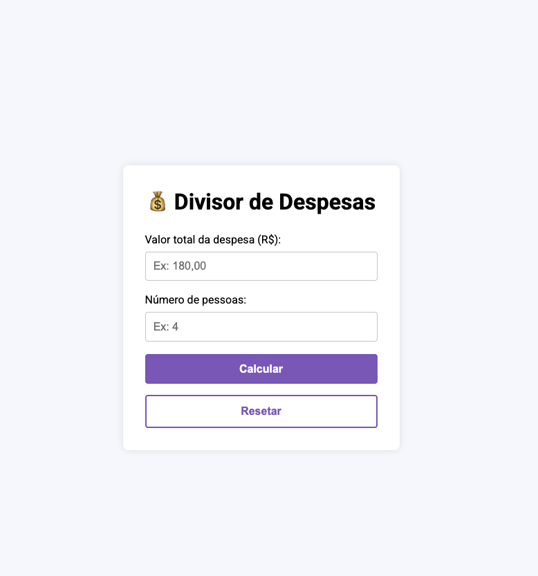

# 💸 Divisor de Despesas

Um projeto simples e divertido feito com **HTML, CSS e JavaScript puro** para calcular quanto cada pessoa deve pagar ao dividir uma conta.  
Além de mostrar o valor individual, o app também exibe um **feedback divertido** com base no valor por pessoa.

---

## 🚀 Funcionalidades

- Inserir valor total da conta
- Definir número de pessoas para dividir
- Calcular valor individual automaticamente
- Exibir frases divertidas de acordo com o valor por pessoa
- Validação de campos com mensagens de erro
- Layout simples e responsivo

---

## 📷 Captura de tela

---

## 🛠️ Tecnologias Utilizadas

- **HTML5** → estrutura do projeto
- **CSS3** → estilização e responsividade
- **JavaScript (Vanilla)** → lógica de cálculo e interatividade

---

## 📄 Licença

Este projeto está sob a licença MIT.
